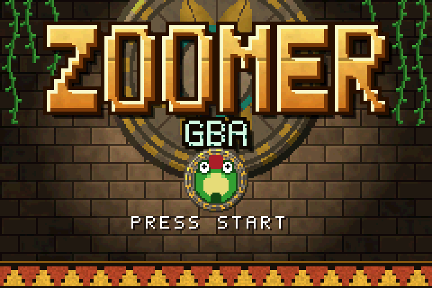
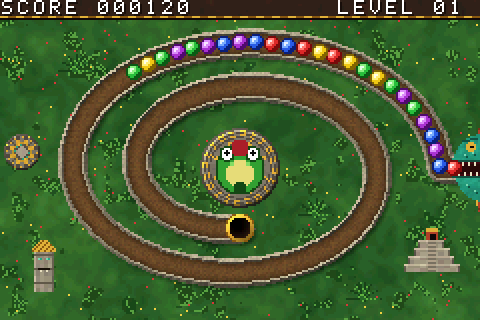
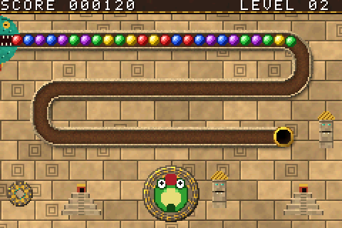
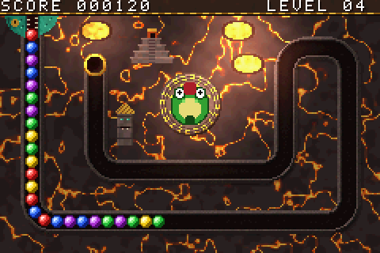
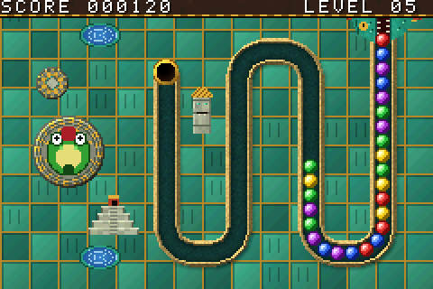

# Zuma GBA



A Zuma-style marble shooter for the Game Boy Advance.

| | |
| --- | --- |
|  |  |
|  |  |

> **Made with AI:** this game was built with [Claude](https://claude.ai), Anthropic's
> AI model, using Claude Code. The code, artwork, music and documentation were
> written by Claude, directed and playtested by [@hjcoggan](https://github.com/hjcoggan).
> See [AI disclosure](#ai-disclosure) below.

## Play it

Download `zuma-gba.gba` from the
[latest release](https://github.com/hjcoggan/zuma-gba/releases/latest) and open
it in any GBA emulator ([mGBA](https://mgba.io) is recommended) or on a flash
cart. No building needed.

## Building from source

You need [devkitPro](https://devkitpro.org)'s GBA toolchain, `make` and `git`.
Python 3 is only needed if you change the artwork (`make assets`).

### macOS

1. Download and run the devkitPro pacman installer (`.pkg`) from
   <https://github.com/devkitPro/pacman/releases>, then install the GBA tools:

   ```bash
   sudo dkp-pacman -S gba-dev
   ```

2. Add the toolchain to your shell (append to `~/.zshrc`, then `source ~/.zshrc`):

   ```bash
   export DEVKITPRO=/opt/devkitpro
   export DEVKITARM=$DEVKITPRO/devkitARM
   export PATH=$DEVKITPRO/tools/bin:$DEVKITARM/bin:$PATH
   ```

3. Install mGBA: `brew install --cask mgba`

4. Build and run:

   ```bash
   git clone https://github.com/hjcoggan/zuma-gba.git ~/zuma-gba
   cd ~/zuma-gba
   make
   open -a mGBA zuma-gba.gba
   ```

### Windows

1. Download the graphical installer (`devkitProUpdater`) from
   <https://github.com/devkitPro/installer/releases> and run it. When it asks
   which components to install, tick **GBA Development**. It installs to
   `C:\devkitPro` and sets the `DEVKITPRO`/`DEVKITARM` variables for you.

2. Open **MSYS2** from the devkitPro folder in the Start menu (a bash shell that
   comes with devkitPro, with `make` and `git`) and build:

   ```bash
   git clone https://github.com/hjcoggan/zuma-gba.git
   cd zuma-gba
   make
   ```

   If `git` is missing, install it with `pacman -S git`.

3. Install mGBA from <https://mgba.io/downloads.html> and open `zuma-gba.gba`
   with it (or drag the file onto the mGBA window).

### Linux

1. Install devkitPro pacman. On Debian, Ubuntu and derivatives:

   ```bash
   wget https://apt.devkitpro.org/install-devkitpro-pacman
   chmod +x ./install-devkitpro-pacman
   sudo ./install-devkitpro-pacman
   ```

   On Arch and other distros, follow
   <https://devkitpro.org/wiki/devkitPro_pacman>.

2. Install the GBA tools, then log out and back in (or run
   `source /etc/profile.d/devkit-env.sh`) so the environment variables are set:

   ```bash
   sudo dkp-pacman -S gba-dev
   ```

   On Arch-based systems the command is `sudo pacman -S gba-dev` after adding
   the devkitPro repositories.

3. Install mGBA: `sudo apt install mgba-qt`, or from Flathub with
   `flatpak install flathub io.mgba.mGBA`.

4. Build and run:

   ```bash
   git clone https://github.com/hjcoggan/zuma-gba.git
   cd zuma-gba
   make
   mgba-qt zuma-gba.gba
   ```

### Tests

The ball-chain logic has host-side tests that build with your normal C compiler:

```bash
make test
```

## Modes

- **Adventure** - six track layouts and five Aztec themes (jungle, temple,
  night, volcano, jade); the combination changes every level and only
  repeats after 30 levels.
- **Endless** - the classic spiral track with a random theme and a chain
  that never stops; it speeds up every 15 seconds and adds a fifth color
  after 90 seconds.

High scores and settings are saved to cartridge SRAM (a `.sav` file in
emulators).

## Controls

| Button | Action |
| --- | --- |
| Left / Right | Aim the frog (fine) |
| L / R | Spin the frog quickly |
| A | Shoot |
| B | Swap current and next ball |
| Start | Pause menu |

The aim and shoot/swap buttons can be swapped in **Settings** (main menu or
pause menu).

## Project layout

```
source/main.c     Game loop, input, rendering (sprites + tile backgrounds)
source/chain.c    Ball chain logic: spawning, pushing, matching, roll-back combos
source/sound.c    Music and sound effects on the GBA's PSG channels
source/ui.c       Text, panels and menus
source/save.c     High scores and settings in SRAM
source/assets*.c  Generated: track layouts, level images, palettes, tiles, font
include/          Headers (gba.h has the hardware registers)
tools/gen_assets.py  Defines the track layouts and draws all artwork, writing
                     assets*.c/assets.h plus build/preview_*.png
tests/            Host-side tests for the chain logic
```

The song is written as text in `source/sound.c` (`lead_src`, `bass_src`,
`drum_src`), so it is easy to edit.

No libraries are needed beyond devkitARM. After editing the artwork or track in
`tools/gen_assets.py`, run `make assets`. Run the logic tests with `make test`.

## AI disclosure

Nearly everything in this repository was generated by Claude (Anthropic) in
Claude Code sessions: the C source, the build setup, the tests, the procedural
artwork generator, the music and sound effects, and this README. A human chose
the features, played the builds and reported what to change. Commits written
this way carry a `Co-Authored-By: Claude` trailer.

The code has host-side tests for the ball-chain logic and has been played in
the mGBA emulator, but it has not been reviewed line by line by a person, so
expect rough edges. Bug reports and pull requests are welcome.

## License

[MIT](LICENSE) - do whatever you like with it. All code, art and music in this
repo is original; the artwork is generated by `tools/gen_assets.py`.

This is an unofficial fan project inspired by PopCap's *Zuma*. It is not
affiliated with or endorsed by PopCap Games or Electronic Arts.
