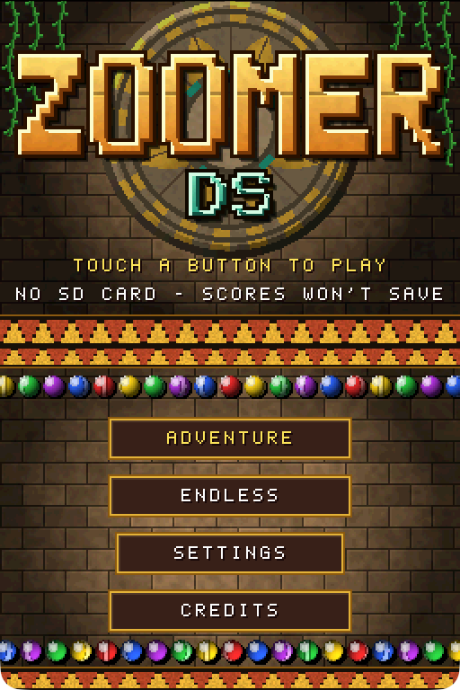
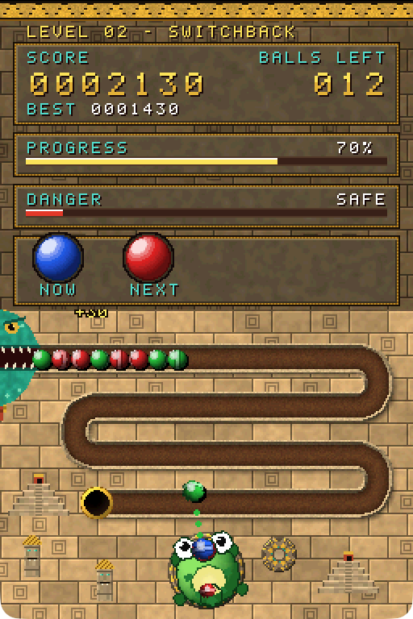
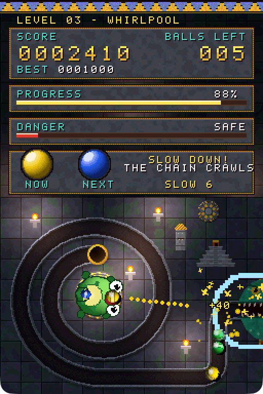
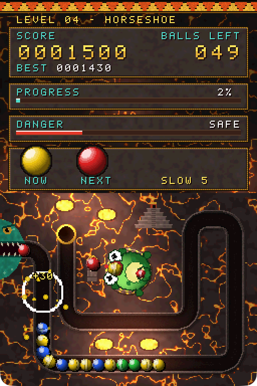
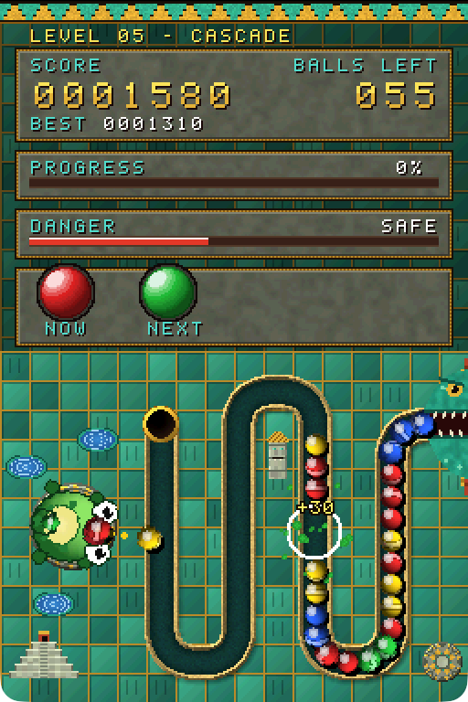
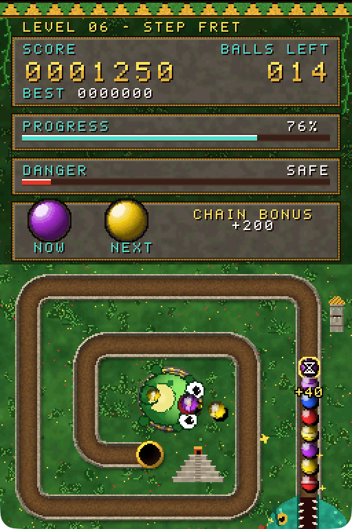
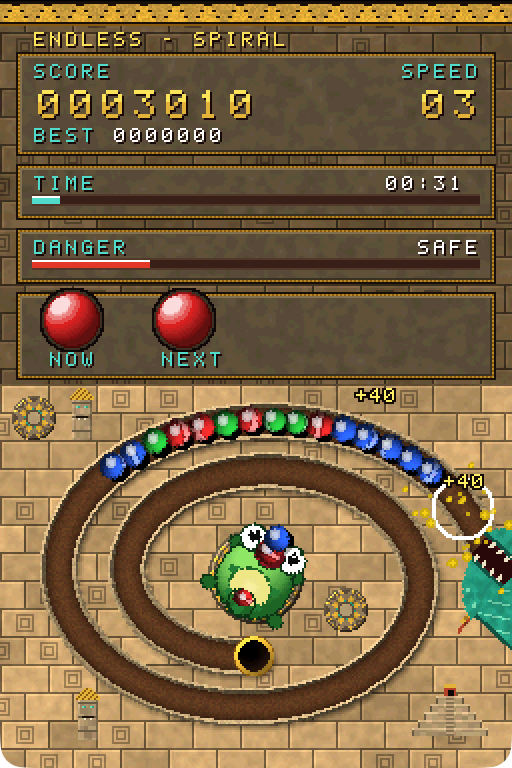

# Zoomer DS



A marble shooter for the Nintendo DS, in the style of *Zuma*. A chain of
coloured balls rolls along a track towards a pit. Spin the stone frog, shoot
balls into the chain and make groups of three or more to pop them before the
chain reaches the end.

This is the DS version of [Zoomer GBA](https://github.com/hjcoggan/zoomer-gba),
rebuilt to use the extra hardware:

- **3D-drawn playfield.** The touch screen uses the DS's 3D engine: bigger
  balls that visibly roll, a frog that turns smoothly to any angle, soft
  shadows and highlights, spark bursts, shockwave rings, floating score
  numbers and screen shake.
- **Two screens.** The whole touch screen is the playfield. The top screen is
  a dashboard: a big score counter, balls left, a progress bar, a danger meter
  that fills as the chain nears the pit, your current and next ball, and combo
  and power-up messages.
- **Touch controls.** Drag the stylus to turn the frog, lift it to shoot and
  tap the frog to swap balls. The frog turns towards the stylus at a steady
  speed rather than snapping to it, so aiming still takes skill. The d-pad and
  buttons work everywhere too.
- **New tracks and full-colour art.** Six track layouts designed for the DS
  screen, each drawn in five Aztec themes as 32,768-colour pictures, with a
  feathered serpent that spits the chain out.
- **Power-up balls.** Slow, Reverse and Bomb balls turn up from level 2.
- **Stereo sound.** Zoomer's five songs on more channels, with a panned echo on
  the melody and a sampled bass. Shots and pops are panned to where they
  happen.

| | |
| :---: | :---: |
|  |  |
| Switchback: four rows snaking down to the frog | Whirlpool: a runway along the bottom into a spiral |
|  |  |
| Horseshoe: a U inside a U, in the fire mountain | Cascade: columns sweeping towards a frog on the left |
|  |  |
| Step Fret: a square Aztec-fret spiral | Endless: the classic spiral, speeding up every 15 seconds |

> **Made with AI:** this game was built with [Claude](https://claude.ai), Anthropic's
> AI model, using Claude Code. The code, artwork, music and documentation were
> written by Claude, directed and playtested by [@hjcoggan](https://github.com/hjcoggan).
> See [AI disclosure](#ai-disclosure) below.

## Play it

Download `zoomer-ds.nds` from the
[latest release](https://github.com/hjcoggan/zoomer-ds/releases/latest) and open
it in a DS emulator ([melonDS](https://melonds.kuribo64.net) is recommended) or
on a flash cart. No building needed.

## How to play

- The chain rolls out of the serpent's mouth towards the pit. If a ball
  reaches the pit, the rest of the chain drains in and the game is over.
- Shoot a ball into the chain to insert it. Three or more of the same colour
  touching pop. If the gap closes and the balls meeting there match, the
  back of the chain rolls back to join them and they pop too: a **combo**.
- Pop groups with consecutive shots for a **chain bonus**.
- Clear every ball in the level to move on. Levels get faster and longer, and
  add a fourth colour from level 3 and a fifth from level 6.

### Power-up balls

| Ball | Effect |
| --- | --- |
| Slow | The chain crawls for 6 seconds |
| Reverse | The chain rolls backwards for 3 seconds |
| Bomb | Blows up every ball nearby |

A power-up goes off when its ball is popped in a match.

### Controls

| Input | Action |
| --- | --- |
| Drag the stylus | Turn the frog towards the stylus |
| Lift the stylus | Shoot where the frog is pointing |
| Tap the frog | Swap current and next ball |
| Left / Right | Spin the frog quickly |
| L / R | Aim the frog (fine) |
| A | Shoot |
| B | Swap current and next ball |
| Start | Pause menu |

In **Settings** (main menu or pause menu) you can swap the d-pad and L/R aim
speeds, swap A and B, and turn the aim guide off.

## Modes

- **Adventure** - six track layouts and five Aztec themes (jungle path, sun
  temple, moon ritual, fire mountain, jade pools); the combination changes
  every level and only repeats after 30 levels.
- **Endless** - the classic spiral track with a random theme and a chain
  that never stops. It speeds up every 15 seconds.

Your best score, furthest level, best endless score and settings are saved to
`zoomer-ds.sav` on the SD card. That works on flash carts, and in melonDS with
DLDI turned on (Config → Emu settings → DLDI). Without an SD card the game
still runs but can't remember scores.

## Building from source

You need [devkitPro](https://devkitpro.org)'s DS toolchain (devkitARM and libnds), `make` and `git`.
Python 3 is only needed if you change the artwork (`make assets`).

### macOS

1. Download and run the devkitPro pacman installer (`.pkg`) from
   <https://github.com/devkitPro/pacman/releases>, then install the DS tools:

   ```bash
   sudo dkp-pacman -S nds-dev
   ```

2. Add the toolchain to your shell (append to `~/.zshrc`, then `source ~/.zshrc`):

   ```bash
   export DEVKITPRO=/opt/devkitpro
   export DEVKITARM=$DEVKITPRO/devkitARM
   export PATH=$DEVKITPRO/tools/bin:$DEVKITARM/bin:$PATH
   ```

3. Install melonDS from <https://melonds.kuribo64.net> (drag it into
   Applications; the first time, allow it under System Settings → Privacy &
   Security → Open Anyway).

4. Build and run:

   ```bash
   git clone https://github.com/hjcoggan/zoomer-ds.git ~/zoomer-ds
   cd ~/zoomer-ds
   make
   open -a melonDS zoomer-ds.nds
   ```

### Windows

1. Download the graphical installer (`devkitProUpdater`) from
   <https://github.com/devkitPro/installer/releases> and run it. When it asks
   which components to install, tick **NDS Development**. It installs to
   `C:\devkitPro` and sets the `DEVKITPRO`/`DEVKITARM` variables for you.

2. Open **MSYS2** from the devkitPro folder in the Start menu (a bash shell that
   comes with devkitPro, with `make` and `git`) and build:

   ```bash
   git clone https://github.com/hjcoggan/zoomer-ds.git
   cd zoomer-ds
   make
   ```

   If `git` is missing, install it with `pacman -S git`.

3. Install melonDS from <https://melonds.kuribo64.net> and open `zoomer-ds.nds`
   with it (or drag the file onto the melonDS window).

### Linux

1. Install devkitPro pacman. On Debian, Ubuntu and derivatives:

   ```bash
   wget https://apt.devkitpro.org/install-devkitpro-pacman
   chmod +x ./install-devkitpro-pacman
   sudo ./install-devkitpro-pacman
   ```

   On Arch and other distros, follow
   <https://devkitpro.org/wiki/devkitPro_pacman>.

2. Install the DS tools, then log out and back in (or run
   `source /etc/profile.d/devkit-env.sh`) so the environment variables are set:

   ```bash
   sudo dkp-pacman -S nds-dev
   ```

   On Arch-based systems the command is `sudo pacman -S nds-dev` after adding
   the devkitPro repositories.

3. Install melonDS from Flathub with `flatpak install flathub net.kuribo64.melonDS`,
   or from <https://melonds.kuribo64.net>.

4. Build and run:

   ```bash
   git clone https://github.com/hjcoggan/zoomer-ds.git
   cd zoomer-ds
   make
   flatpak run net.kuribo64.melonDS zoomer-ds.nds
   ```

### Tests

The ball-chain logic has host-side tests that build with your normal C compiler:

```bash
make test
```

### Debug builds

- `make AUTOPLAY=<level>` builds a ROM that plays itself from that level
  (`0` for endless).
- `make AUTOTEST=1` builds a ROM that steps through every menu and mode with
  scripted button and touch input.
- `make DEBUGHUD=1` adds a frame counter and a crash dump screen.

Run `make clean` before switching between these and a normal build.

## Project layout

```
source/main.c     Game states, touch and button input, the dashboard, menus
source/chain.c    Ball chain logic: spawning, pushing, matching, roll-back combos, power-ups
source/scene.c    The 3D playfield: balls, frog, aim guide, particles and score popups
source/gfx.c      Both screens: full-colour pictures, text layers, panels, sprites, fades
source/sound.c    Music and sound effects on the DS's 16 sound channels
source/save.c     High scores and settings in a file on the SD card
source/assets.c   Generated: 3D textures, top-screen sprites, font
source/tracks.c   Generated: the six track layouts
data/*.bin        Generated: the full-colour 256x192 screen pictures (LZ77)
tools/gen_assets.py  Defines the track layouts and draws all artwork, writing
                     the files above, icon.bmp and build/preview_*.png
tests/            Host-side tests for the chain logic
```

The game uses libnds and libfat from devkitPro's `nds-dev`. After editing the
artwork or tracks in `tools/gen_assets.py`, run `make assets`.

## AI disclosure

Nearly everything in this repository was generated by Claude (Anthropic) in
Claude Code sessions: the C source, the build setup, the tests, the procedural
artwork generator, the music and sound effects, and this README. A human chose
the features, played the builds and reported what to change. Commits written
this way carry a `Co-Authored-By: Claude` trailer.

The code has host-side tests for the ball-chain logic and has been played in
the melonDS emulator, but it has not been reviewed line by line by a person,
so expect rough edges. Bug reports and pull requests are welcome.

## License

[MIT](LICENSE) - do whatever you like with it. All code, art and music in this
repo is original; the artwork is generated by `tools/gen_assets.py`.

This is an unofficial fan project inspired by PopCap's *Zuma*. It is not
affiliated with or endorsed by PopCap Games or Electronic Arts.
